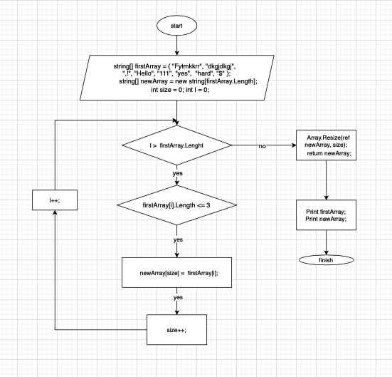

Задача:

Написать программу, которая из имеющегося массива строк формирует массив из строк, длинна которых меньше либо равна 3 символа.

Решение:

Задаем массивы и переменные:

Массив строк, <= 3 (string[] firstArray = { "Fytmkkrr", "dkgjdkgj",  ",!", "Hello", "111", "yes",  "hard", "$" });
Массив, содержит строки <= 3, длинна массива = длинне первого (string[] newArray [firstArray.Length]);
Переменные: счетчик для цикла int i = 0, размер массива int size = 0.
Алгоритм выглядит следующим образом: 

Прописываем метод, принимающий заданный массив и выдающий новый массив со строками <= 3 (GetNewArray).

Внутри метода:

С помощью цикла for, перебираем строки массива с условием: если строка меньше или равна 3, то кладем ее в новый массив строк newArray;
Увеличивая счетчик int size на 1;
По окончании сортировки массива firstArray, изменяем количество элементов в одномерном массиве newArray до указанной величины size с помощью встроенного метода Array.Resize;
Выводим оба массива на экран для сравнения.

Для этого испольщуем метод void PrintArray, принимающего массив строк.

Внутри метода, с помощью цикла foreach, перебираем каждую строку массива и выводим на экран, в одну строчку.

Задача решена.
